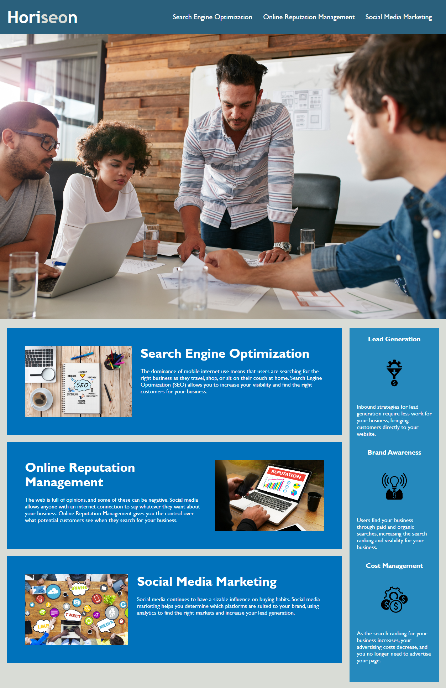

# code-refactor-challenge #

**Note:** This repo contains my personally refactored, condensed, and overall improved website source code for Challenge 01 of the GA Tech 2022 Coding Bootcamp.

---

## Horiseon Social Solutions Services ##

Horiseon Social Solutions Services, Inc. is a company that excels in the growing fields of search engine optimization, online reputation management, and social media marketing. To help promote its image, an accessible, well-designed website is an absolute must.

In aims of that goal, the codebase has been completely refactored and condensed to improve readability, accessibility, and search engine optimization. The CSS stylesheet alone has had its lines of code reduced by a massive 27%! Care has been taken to maintain full functionality, readability, and provide improved code documentation.

TODO: Scale as necessary.

---

